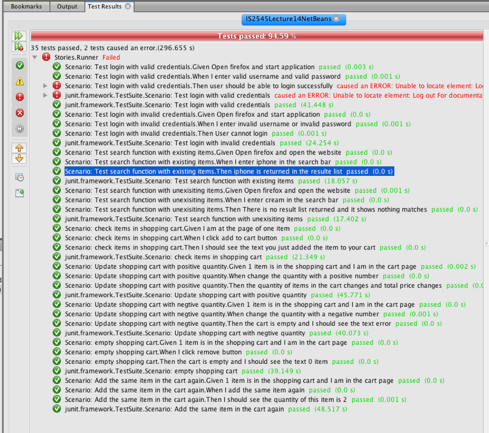
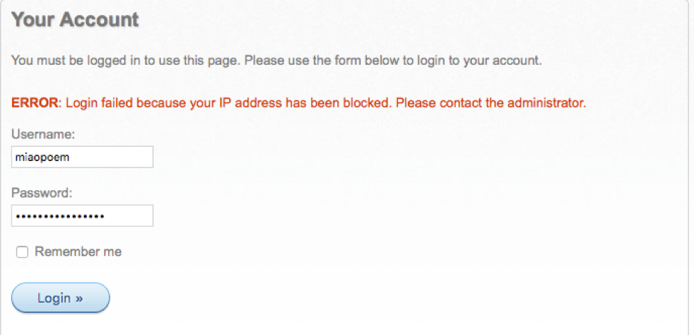
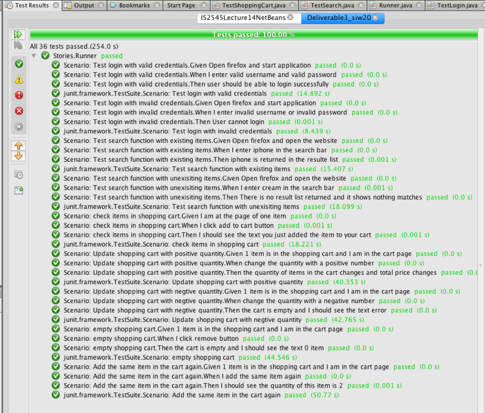

# IS2545 - DELIVERABLE 3: E-commerce website BDD model test
### Simiao Wang (pittID: siw20)
***

### 1. Summary for the test
  * For the environment setting up
    * I am a mac user, so change the web driver in the libs
    * I also tried to user different firefox browser version and set up the environment with maven which also works
  * Testing
    * It is very challenging to use cucumber for annotation
    * Most scenarios fail because the elements I checked have not been return when the program runs.
    * Use Thread.sleep() method to solve this kind of problem
    * For the login failure I met, it is because the account is blocked because of multiple invalid credential submitted as showed in the graph below.
    
    

### 2. Stories and scenarios

<strong>Story 1:</strong> As a registered user, if I typed in the valid credential, I can log in. Otherwise, I cannot log in
* Scenario 1: Test login with valid credentials
    * Given Open firefox and start application
    * When I enter valid username and valid password
    * Then user should be able to login successfully
* Scenario 2: Test login with invalid credentials
    * Given Open firefox and start application
    * When I enter invalid username or invalid password
    * Then User cannot login

<strong>Story 2:</strong> As a user, I need to be able of add items into cart, update quantity and remove items
* Scenario 1: check items in shopping cart
    * Given I am at the page of one item
    * When I click add to cart button
    * Then I should see the text you just added the item to your cart
* Scenario 2: Update shopping cart with positive quantity
    * Given 1 item is in the shopping cart and I am in the cart page
    * When change the quantity with a positive number
    * Then the quantity of items in the cart changes and total price changes
* Scenario 3: Update shopping cart with negative quantity
    * Given 1 item is in the shopping cart and I am in the cart page
    * When change the quantity with a positive number
    * Then the quantity of items in the cart changes and total price changes
* Scenario 4: empty shopping cart
    * Given 1 item is in the shopping cart and I am in the cart page
    * When I click remove button
    * Then the cart is empty and I should see the text 0 item
* Scenario 5: Add the same item in the cart again
    * Given 1 item is in the shopping cart and I am in the cart page
    * When I add the same item again
    * Then I should see the quantity of this item is 2

<strong>Story 3:</strong> As a user, if I search for something the website has, it should return me a list of items. Otherwise, nothing returned
* Scenario 1: Test search function with existing items
  * Given Open firefox and open the website
  * When I enter iphone in the search bar
  * Then iphone is returned in the resulte list

* Scenario 2: Test search function with unexisiting items
  * Given Open firefox and open the website
  * When I enter cream in the search bar
  * Then There is no result list returned and it shows nothing matches

### 3. Test Result
  
